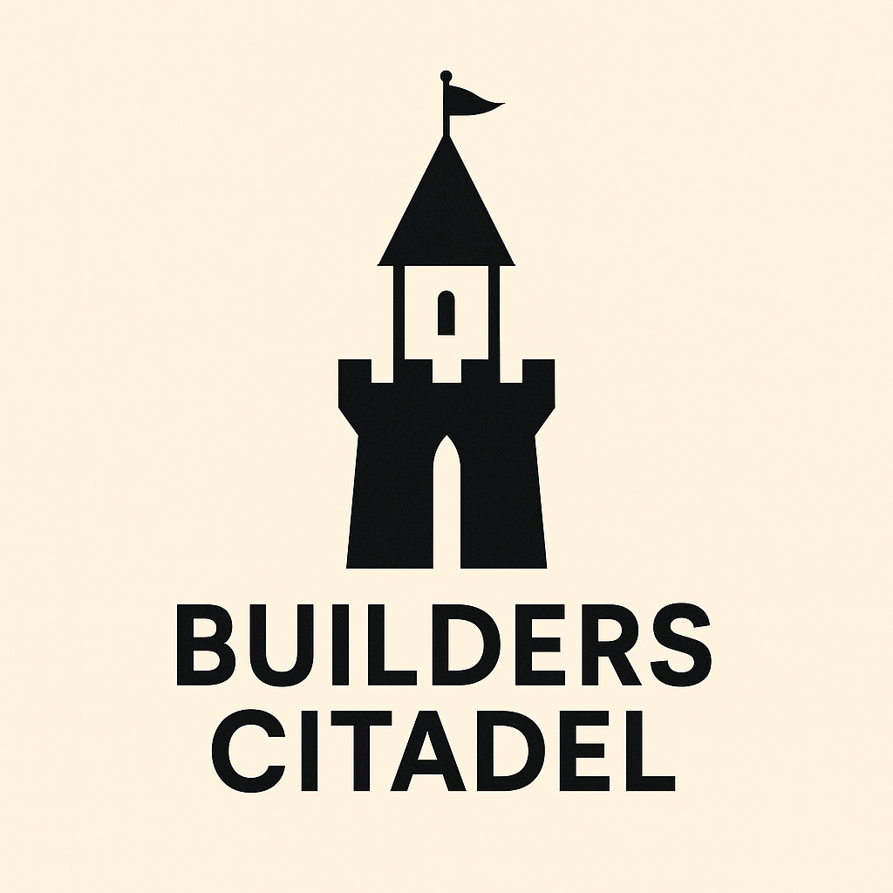

# Builders Citadel 

**Builders Citadel** is a planned strategy game where players build and manage a city on a hexagonal grid. The main focus is on economic simulation, resource management, and strategic planning.

## Concept

In **Builders Citadel**, players construct their city using hex tiles. Each tile can host different buildings and infrastructure, which together drive the city’s economy. The goal is to create a thriving economic hub through careful resource management and city development.

## Planned Features

- Hex-based grid system for city building  
- Various building types with unique functions  
- Resource management (e.g., raw materials, food, currency)  
- Economic simulation including supply and demand  
- Infrastructure upgrades and expansions  
- Dynamic challenges and events  

## Installation

*(Coming soon)*

## Contributing

The project is currently in early development. If you’re interested in contributing, feel free to reach out!

## License

*(To be determined)*
